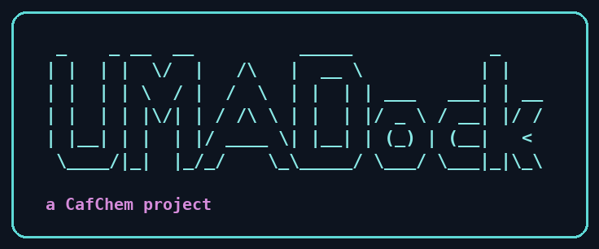
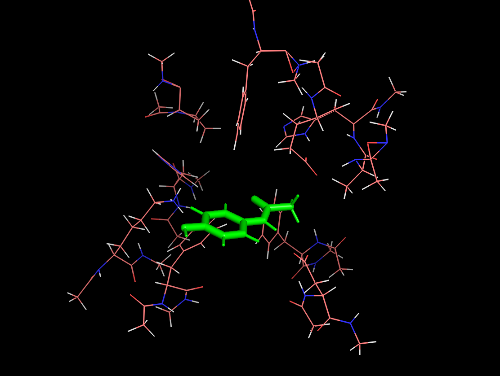
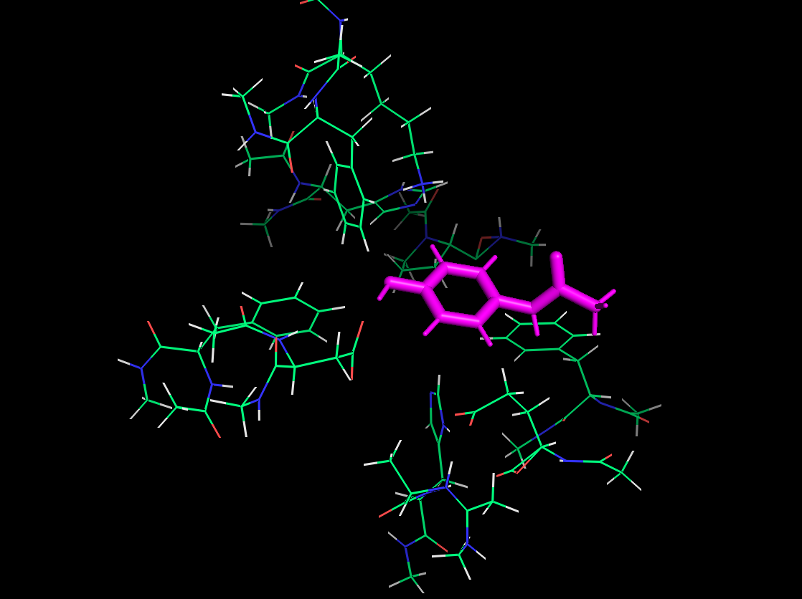
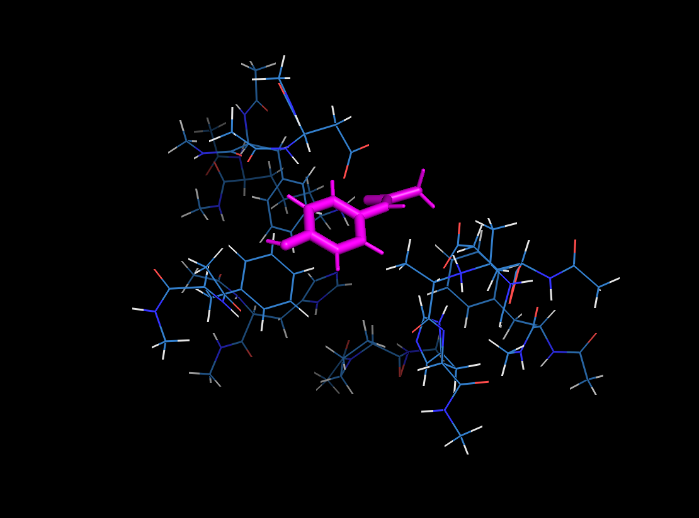
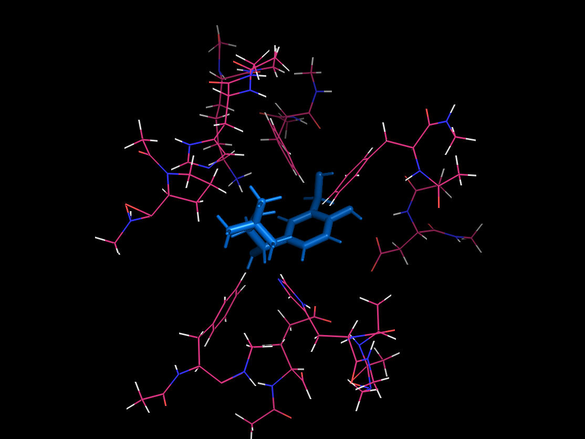
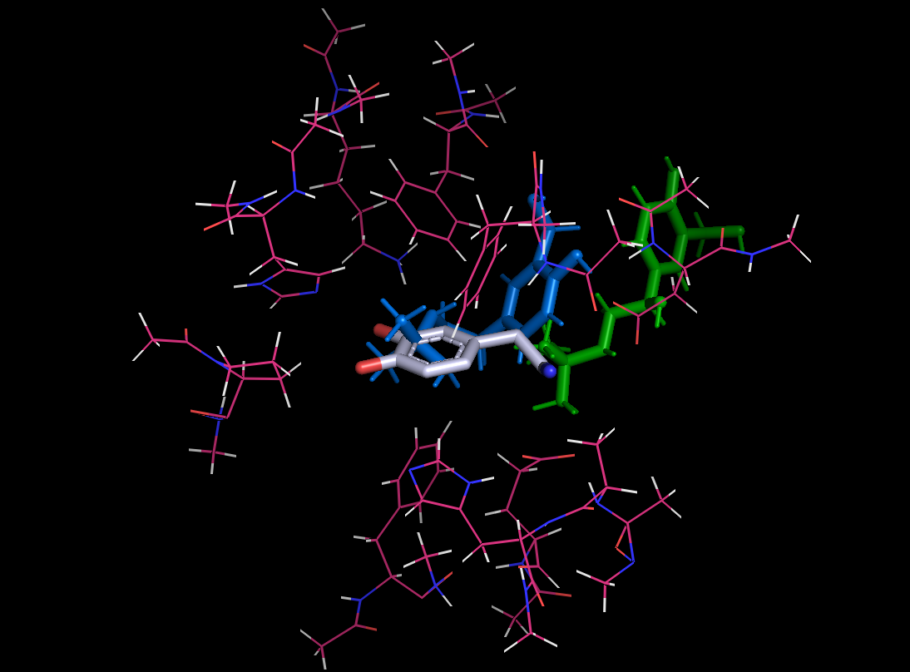

<p align="center">
  
</p>

# UMA-Dock
Docking molecules in protein binding sites, scored with a pluggable MLIP energy function (Meta's UMA by default; MACE-OMOL-0 and AIMNet2 also supported — see *Scoring model* below). Also runs with an AI Agent.
- creates conformations of the input molecule with RDKit
- **Prepares a binding site from any PDB + ligand residue name** (no hand-pruning): finds residues within 4 A of the ligand, caps cut termini with ACE/NME, and assigns ff14SB charges/protonation
- Docks the conformers into the prepared binding site
-  Evaluates pose energy with the selected scoring model (`--model`: `uma` default, `mace-omol`, or `aimnet2`)
-  Optimizes best pose from each conformer
-  Calculates an explicit desolvation energy and a ligand strain energy; combines these with the interaction energy for an electronic binding energy.
-  Chooses the best overall pose. `UMA_Dock` also has a `run_md_from_xyz` method for optional rudimentary dynamics on that pose (a manual follow-up step — not run automatically by the Modal pipeline).
-  **Modal is the recommended way to run** (see *Run end-to-end on Modal* below); the `notebooks/` Colab examples are the original/legacy interactive path.
-  The default `uma` scorer needs a HuggingFace token and access to the Meta FAIR-Chem repo; `mace-omol` and `aimnet2` don't need Meta repo access (see *Scoring model*).

## Contents
- [Project layout](#project-layout)
- [Prepare a binding site from any PDB (`prep_binding_site.py`)](#prepare-a-binding-site-from-any-pdb-prep_binding_sitepy)
  - [From the command line](#from-the-command-line)
  - [From Python](#from-python)
  - [Structural metal ions](#structural-metal-ions)
- [Run end-to-end on Modal (`code/modal_test.py`)](#run-end-to-end-on-modal-codemodal_testpy)
  - [Caching & retrieving results (Modal Volumes)](#caching--retrieving-results-modal-volumes)
  - [Scoring model (`--model`)](#scoring-model---model)
- [Validated result: paracetamol / SULT1A3](#validated-result-paracetamol--sult1a3)
- [Cross-check against explicit-solvent MD + MM-GBSA: salbutamol / SULT1A3](#cross-check-against-explicit-solvent-md--mm-gbsa-salbutamol--sult1a3)
- [CLI_version](#cli_version)
- [Run from an Agent](#run-from-an-agent)
- [Set-up](#set-up)
  - [Local (venv, Python 3.11)](#local-venv-python-311)
  - [Colab (legacy)](#colab-legacy)
- [Run with mostly defaults](#run-with-mostly-defaults)
- [Sample Output](#sample-output)
- [Agent output](#agent-output)
- [Citations](#citations)
- [To-do list](#to-do-list)

## Project layout
```
UMADock/
  code/                 # all source
    UMADock/             # importable package: UMADock.py, prep_binding_site.py
    modal_test.py        # Modal cloud runner
    center.py            # standalone fragment-recentering CLI
  data/                  # reusable cache (committed; regenerated on demand)
    pdbs/<id>.pdb        # raw PDBs (fetched once from RCSB)
    sites/<name>.xyz     # prepared binding sites (capped + charged, Cα constraints)
    sites/<name>.meta.json   # pdb_id / resname / cutoff / ph / charge / spin / constraints / size
  output/                # per-run output (gitignored): optimized poses + result.json
  notebooks/  CLI_version/  video/
```
`data/` caches the deterministic prep inputs/outputs so a repeat target skips the RCSB fetch and the PDBFixer repair/select/cap/charge step. `output/` holds one subfolder per run (`<name>_<model>_<UTC>/`) with the optimized bound complex and a `result.json`; it is never reused.

## Prepare a binding site from any PDB (`prep_binding_site.py`)
UMADock used to require a pre-pruned active-site XYZ (the `*_QM_site.xyz` files in `CafChem/data`, cut and capped by hand). `prep_binding_site.py` now automates that, reusing the OpenMM / PDBFixer machinery from the sibling `openmm` repo:

1. **Repair** the raw PDB with PDBFixer (patch missing heavy atoms; add H at pH; no loop modeling).
2. **Select** the ligand by residue name and keep every protein residue with a heavy atom within a cutoff (default 4 A) of any ligand heavy atom.
3. **Cap** each cut chain end with ACE (N-side) / NME (C-side), placed off the backbone geometry, so the isolated cluster is chemically closed.
4. **Protonate + charge**: the cluster is typed with AMBER ff14SB at the target pH, and the net formal charge is read off the partial-charge sum. `spin` defaults to 1 (closed shell).
5. **Write** the cluster XYZ and return a `bs_object` (`file_location`, `name`, `charge`, `spin`, `constraints`, `size`) ready for `UMA_Dock`. `constraints` are the **alpha carbons (Cα)** of the selected residues — one backbone anchor per residue, held fixed during UMA's optimization. This mirrors the hand-cut `*_QM_site.xyz` sites, which pin exactly the Cα of every residue (verified against `CafChem/data`); the ACE/NME caps are left free to relax into the cut termini.

Ligand atoms define the site only; they are not written into the binding-site XYZ (the ligand is docked separately).

### From the command line
```sh
python code/UMADock/prep_binding_site.py protein.pdb LIG -c 4 --ph 7 -n MYTARGET -o out/        # monomer
python code/UMADock/prep_binding_site.py 2A3R.pdb LDP -c 4 --ph 7 -n SULT1A3 -o out/ --chain A  # oligomer: pick one chain
# -> out/MYTARGET.xyz  (+ out/MYTARGET_capped.pdb for inspection) and a printed bs_object
```

### From Python
```python
import sys; sys.path.insert(0, "code")
from UMADock import prep_binding_site as prep
# chain= restricts the site to one ligand copy's chain -- needed for oligomers
# (2A3R is a homodimer; chain="A" keeps the site to one protomer's pocket)
bs = prep.prepare_binding_site("2A3R.pdb", "LDP", cutoff=4.0, ph=7.0, name="SULT1A3",
                               output_dir="out", chain="A")
# bs is the dict you'd otherwise have to write by hand:
# {'file_location': 'out/SULT1A3.xyz', 'name': 'SULT1A3', 'charge': -1, 'spin': 1,
#  'constraints': [... 10 Cα ...], 'size': 275}
```

> **Oligomers — pass `--chain` / `chain=`.** `prepare_binding_site` selects residues
> around *every* copy of the ligand, so for an oligomer with the same ligand in each
> chain it would span every protomer. Pass `--chain` to restrict the site to one
> ligand copy's chain. For 2A3R (a homodimer), `--chain A` yields a single coherent
> pocket: **275 atoms, 10 residues, net charge −1**.
>
> **Charged residues** (SULT1A3 / 2A3R chain A, ff14SB at pH 7): LYS106 (+1),
> GLU146 (−1), ASP86 (−1) → net −1; His108 and His149 are neutral at pH 7.

> Note: UMADock's `get_binding_site_xyz` parser matches a 2-3 digit atom count, so binding sites are currently limited to <1000 atoms. A 4 A single-ligand single-chain site is typically well under that (the SULT1A3 chain-A site is 275 atoms / 10 residues).

### Structural metal ions
A structural metal ion (`SUPPORTED_METAL_RESNAMES`: ZN/FE/FE2/MG/CA/MN/CU/NI/CO/CD/HG) within the cutoff of the ligand is kept as a bare atom in the cluster — crystal position, formal +2 charge folded into `bs_object["charge"]`, no coordination-restraint bonded model (unlike the sibling `openmm` repo's classical-FF pipeline — the MLIP evaluates the metal–ligand electronics directly). Two knobs:

- `keep_metals` (default `True`) — drop the ion instead with `keep_metals=False` / `--no-keep-metals`.
- `constrain_metals` (default `False`) — pin the metal at its crystal position (added to `constraints` alongside the per-residue Cα anchors) instead of leaving it free to relax. `--constrain-metals` on the CLI.

> **AIMNet2 does not support metals.** Its element coverage is H/B/C/N/O/F/Si/P/S/Cl/As/Se/Br/I only, so `--model aimnet2` will fail at scoring on any site with a kept structural metal. Use `uma` or `mace-omol` instead.

Validated end-to-end on PDB **1ZNF** (a Cys2His2 zinc finger; apo, so `ligand_resname="ZN"` was used as the site-defining anchor in place of a crystal ligand) with phenol docked as a stand-in ligand, `uma` model, run once unconstrained and once with `--constrain-metals`:

| | unconstrained | constrained |
|---|---|---|
| electronic binding energy | −1.151 kcal/mol | −5.077 kcal/mol |
| Zn final position vs. crystal | drifted ~0.5 Å | pinned exactly |

(Sampling noise, not a benchmark — only 50 placement tries / 2 conformers each, and each run landed on a different best conformer.)

## Run end-to-end on Modal (`code/modal_test.py`)
`modal_test.py` is a **general cloud runner**: dock any small molecule (SMILES) into any protein binding site defined by a crystal ligand in a PDB, entirely on a cloud GPU. It builds the binding site on the fly with `prepare_binding_site` (repair + 4 Å residue selection + ACE/NME capping + ff14SB charges), generates ligand conformers, docks with UMA, optimizes the best pose, and computes the electronic binding energy (optimized interaction + desolvation + strain). The hand-cut `CafChem/data/*_QM_site.xyz` structures are not used by this path (they still work for the original DUDE targets).

The PDB comes from either an RCSB id (`--pdb-id`, fetched inside the container) or a local file (`--pdb-path`, shipped to the container — no image rebuild). Defaults reproduce the validated paracetamol / SULT1A3 test (below) — add `--chain A` for 2A3R, which is a homodimer.

Two ways to run, both via `modal run --detach` (the `--detach` keeps the ephemeral app alive after the local client exits):

```sh
pip install modal && modal token new
modal secret put huggingface-secret HF_TOKEN              # one time; needs Meta FAIR-Chem repo access
```

**Stay-at-the-keyboard (attached, blocks until done, materializes the pose locally):**
```sh
# default = paracetamol into SULT1A3 (RCSB 2A3R, ligand resname LDP), T4 (~$0.59/hr)
modal run --detach code/modal_test.py --chain A            # 2A3R is a homodimer -> pick one chain
modal run --detach code/modal_test.py --smiles "CC(=O)Oc1ccccc1C(=O)O" --pdb-path ./my_protein.pdb --ligand-resname LIG --name MYT
```

**Walk away / close the laptop (fire-and-forget, lid-close-safe) — use `::spawn_main`:**
```sh
# spawns run_test on Modal's servers and the local process EXITS in seconds; the
# call runs server-side independent of your laptop, so a lid-close/sleep/lost WiFi
# cannot cancel it. Retrieve the result from the umadock-runs volume + app logs.
UMADOCK_GPU=A100 modal run --detach code/modal_test.py::spawn_main \
  --model mace-omol --mace-dtype float64 --num-confs 3 --number-tries 200 \
  --pdb-id 2A3R --ligand-resname LDP --name SULT1A3 --chain A \
  --smiles "CC(=O)Nc1ccc(O)cc1"

UMADOCK_GPU=T4 modal run --detach code/modal_test.py::spawn_main \
  --smiles "Cc1ccccc1O" --pdb-id 2A3R --ligand-resname LDP --name SULT1A3 --chain A
```
After it exits, monitor with `modal app list` / `modal app logs <app-id>`, and pull the result with `modal volume get umadock-runs /<name>_<model>_<UTC>/result.json .` (see Caching & retrieving results below).

GPU is set by the `UMADOCK_GPU` env var (default T4; A10G ~$1.10, A100 ~$2.10/hr) — not a flag, because the flag would be read after the container's GPU is already bound.

> **Lid-close / laptop sleep — important.** The default `main` entrypoint calls `.remote()`, which keeps a **local client alive streaming logs for the whole run**. With `--detach` that client survives a mere *network drop* (client still running) and a graceful Ctrl-C, but it does **NOT** survive the laptop going to sleep: macOS freezes the streaming client process, it gets hard-killed, and the cancel propagates to the "detached" function. For any run you walk away from, use **`::spawn_main`** instead: it calls `.spawn()` and the local process exits in seconds, leaving the call running server-side with no local client to freeze. (Interrupting during image build can still kill the launch either way — confirm the run reached the dock phase, i.e. the `adding fragment: conf_0` log line, before walking away.) To stop a run: `modal app stop <app-id>`.

### Caching & retrieving results (Modal Volumes)
- **`umadock-data-cache`** (`/root/data`): reusable cache — `data/pdbs/<id>.pdb` (raw PDBs, fetched once from RCSB) and `data/sites/<name>.xyz` + `<name>.meta.json` (prepared binding sites, deterministic for a given PDB + resname + cutoff + ph, so a repeat target skips the PDBFixer repair/select/cap/charge prep).
- **`umadock-runs`** (`/root/output`): per-run `output/<name>_<model>_<UTC>/` with `opt_files/<...>_OPTIMIZED.xyz` (the final bound complex) + `result.json`. These persist so the final pose is **not** lost with the ephemeral container.
- **`umadock-hf-cache`** (`/root/.cache/huggingface`), **`umadock-mace-cache`** (`/root/.cache/mace`), **`umadock-aimnet-cache`** (`/root/.cache/aimnet`): per-scorer model-weight caches, one per `--model` (UMA/HF, MACE, AIMNet2) so the (multi-GB, for UMA/MACE) weights are only downloaded once.
- **Retrieving the final pose:** an attached `modal run` writes the best pose + `result.json` into the LOCAL repo `output/` tree. For a `--detach` run that outlives the local client, pull them from the volume instead, e.g. `modal volume get umadock-runs /<name>_<model>_<UTC>/result.json .`. The binding energy is always printed to `modal app logs <app-id>`.

### Scoring model (`--model`)
UMA-Dock scores poses with any ASE calculator, so the energy model is pluggable. `--model` selects one (see `build_calculator()` in `UMADock.py`):

| `--model` | what | elements | notes |
|---|---|---|---|
| `uma` (default) | Meta's UMA via FAIRChem (omol task) | broad | needs the HF secret + Meta FAIR-Chem repo access. Model id defaults to `uma-s-1p1` (fairchem renamed the bare `uma-s-1`); override with `UMADOCK_UMA_MODEL`. |
| `mace-omol` | MACE-OMOL-0 — the MACE analog of UMA's omol task | 89 | larger/slower model; checkpoint URL overridable via `UMADOCK_MACE_OMOL_URL`. |
| `aimnet2` | AIMNet2 ([isayevlab/aimnetcentral](https://github.com/isayevlab/aimnetcentral)) | 14 (H, B, C, N, O, F, Si, P, S, Cl, As, Se, Br, I) | organic/elemental-organic MLIP; self-validates element coverage. **No metals** — fails on any site with a kept [structural metal ion](#structural-metal-ions). Model variant `aimnet2-2025` by default, override via `UMADOCK_AIMNET2_MODEL`. Weights download from Hugging Face on first use. |

Model weights are cached in Modal Volumes after the first run so later runs skip the download. MACE needs `mace-torch>=0.3.14`, AIMNet2 needs `aimnet[ase]` (both installed in the Modal image; add them to your local env if you use `build_calculator(...)` locally).

**Sampling:** placement tries the ligand center on a Gaussian whose σ is the binding site's spatial spread and keeps a pose only if it lands within 5 Å of the site center. A large site has a large σ, so the old 10-try default gives ~0 accepted poses — the script default is now 200 tries. The dock phase (single-point UMA evals) is cheap; only the per-pose optimization + desolvation is costly, so scaling `--number-tries` is nearly free — scale it up for larger sites.

## Validated result: paracetamol / SULT1A3
Full runs on a T4 (UMA) and an A100 (MACE-OMOL), each 3 conformers × 200 placement
tries, completed end-to-end under the Cα constraint convention. The binding site is
prepared from 2A3R **chain A only** (`--chain A` — 2A3R is a homodimer): **275 atoms,
10 residues, net charge −1**, constraints = the **10 alpha carbons (Cα)** held fixed
during optimization (the ACE/NME caps relax freely).

| scorer | GPU | best conf / pose | electronic binding energy |
|---|---|---|---|
| UMA (`uma-s-1p1`) | T4 | conf 2 / pose 12 | **−34.94 kcal/mol** |
| MACE-OMOL-0 (float64) | A100 | conf 2 / pose 15 | **−4.91 kcal/mol** |
| AIMNet2 (`aimnet2-2025`) | T4 | conf 2 / pose 20 | **−23.74 kcal/mol** |

<p align="center">
  
  &nbsp;
  
  &nbsp;
  
</p>

Optimized best poses for paracetamol in the SULT1A3 (2A3R chain A) pocket — UMA (left, −34.94 kcal/mol), MACE-OMOL (middle, −4.91 kcal/mol), and AIMNet2 (right, −23.74 kcal/mol).

All three scorers give **negative (favorable)** binding energies for paracetamol in the
single-chain pocket — paracetamol sits in a real pocket and makes favorable contacts.
The scorers disagree on magnitude (UMA most favorable, MACE-OMOL least, AIMNet2 in
between), which is expected for different MLIPs on a small-molecule/protein interface;
the **sign agreement** is what validates the full PDB-forced pipeline: fetch →
`prepare_binding_site` (chain A) → conformers → dock → optimize → desolvation/strain →
binding energy. (AIMNet2 ran fast on a T4, unlike MACE-OMOL which needed an A100.)

Charged residues in the chain-A site (ff14SB, pH 7): LYS106 +1, GLU146 −1, ASP86 −1
(net −1); His108 and His149 neutral.

## Cross-check against explicit-solvent MD + MM-GBSA: salbutamol / SULT1A3
As an external sanity check (not part of the repeated validated protocol above), salbutamol
was docked into the same SULT1A3 chain-A pocket (UMA, T4, 15 conformers × 200 tries) and
compared against a full-protein, explicit-solvent MD + MM-GBSA calculation of the same
ligand/target pair (1000-frame trajectory average, GBn2/igb=8), run independently in a
separate MD pipeline.

| method | ΔG (kcal/mol) | notes |
|---|---|---|
| UMADock (UMA) | **−59.73** | best of 15 conformers (electronic binding energy: interaction −75.68, strain +5.64, desolvation +10.31) |
| MM-GBSA | **−28.38 ± 4.03** | full 2A3R dimer + explicit solvent, 1000-frame ensemble average |

Both favorable (sign agreement), though UMADock's static best-pose estimate runs ~2× more
favorable in magnitude — expected given the very different theoretical frameworks (a single
best-pose ML-potential energy vs. a classical-force-field free energy averaged over an
explicit-solvent MD ensemble), consistent with UMA's tendency toward the most favorable
numbers among the scorers above.

Heavy-atom ligand RMSD against the MM-GBSA run's docked (t=0) and equilibrated (last-frame)
poses put UMADock's pose several Å from both (6.9–8.3 Å direct, 1.3–1.5 Å after best-fit
superposition — so a similar ligand conformation, landing in a different sub-pocket location).
Visually, though, UMADock's pose sits closer to the pocket center and looks more chemically
reasonable than the MM-GBSA run's final frame — notable since MM-GBSA had the context of the
**entire** protein (both monomers) and explicit solvent, while UMADock only ever sees the
truncated, capped ~275-atom chain-A cluster:

<p align="center">
  
  &nbsp;
  
</p>

Left: UMADock's best pose. Right: a three-way overlay — the crystallographic **LDP** ligand
that defines the pocket (silver), **UMADock**'s pose (blue), and the **AutoDock/MM-GBSA**
pose (green) — all in the same crystallographic coordinate frame (2A3R, no recentering), so
the offsets shown are real positional differences, not a plotting artifact.

## CLI_version
-  See the CLI_version folder for an implementation to be run from the command line.
-  includes example scripts for running docking and MD.

## Run from an Agent
See `notebooks/AgentUMADock.ipynb` for calling UMADock from an AI agent (LangGraph +
HuggingFace Phi4-mini-instruct). That notebook's original Gradio-client path is
**deprecated** — call UMADock directly (`import UMADock.UMADock as ud`) in the agent's
tool, or drive a Modal run from the agent instead of a Gradio server.

## Set-up
(UMADock has its own dependencies, including RDKit and py3Dmol; see notebooks for examples)

Two tiers of dependencies:
- **`requirements.txt`** (openmm, pdbfixer, rdkit, ase, py3Dmol, numpy, scipy, pandas, matplotlib) — enough to run **`prep_binding_site.py`** and the plotting/analysis helpers.
- **`requirements-mlip.txt`** (torch + fairchem-core) — **required to import `UMADock.py` at all** (it imports torch/fairchem at module top), and to actually score poses with UMA. Needs a HuggingFace token + access to Meta's FAIR-Chem repo (see `requirements-mlip.txt`).
- **optional:** `mace-torch>=0.3.14` — only if you use `build_calculator("mace-omol")` (MACE-OMOL-0) instead of UMA. The Modal image installs it automatically.
- **optional:** `aimnet[ase]` — only if you use `build_calculator("aimnet2")` (AIMNet2) instead of UMA. The Modal image installs it automatically.

The source lives in `code/`: the importable package is `code/UMADock/` (modules `UMADock.UMADock`, `UMADock.prep_binding_site`), and the runners are `code/modal_test.py` and `code/center.py`.

### Local (venv, Python 3.11)
```sh
uv venv --python 3.11 .venv && source .venv/bin/activate
pip install -r requirements.txt          # core
pip install -r requirements-mlip.txt     # torch + fairchem-core (HF token needed for the UMA weights)
pip install "mace-torch>=0.3.14"         # optional: MACE-OMOL-0 scorer
pip install "aimnet[ase]"                # optional: AIMNet2 scorer
```
The library imports as a package from `code/`: from the repo root, `import sys; sys.path.insert(0, "code")` then `import UMADock.UMADock as ud` / `from UMADock import prep_binding_site as prep` (the Colab-only `google.colab` import is guarded). The `CLI_version/UMADock.py` variant has the Colab bits commented out for a pure-CLI run.

### Colab (legacy)
Modal (above) is the recommended way to run. The Colab snippet below is the
original interactive path and still works for the CafChem/DUDE targets; it needs a
Colab GPU runtime and the HuggingFace token in your notebook secrets.
```
!git clone https://github.com/MauricioCafiero/CafChem.git
!git clone https://github.com/MauricioCafiero/UMADock.git

import sys
sys.path.insert(0, "UMADock/code")      # the package code/UMADock lives here

import torch
import numpy as np
from fairchem.core import FAIRChemCalculator, pretrained_mlip

import UMADock.UMADock as ud

device = "cuda" if torch.cuda.is_available() else "cpu"

predictor = pretrained_mlip.get_predict_unit("uma-s-1p1", device=device)   # current fairchem renamed "uma-s-1" -> "uma-s-1p1"/"uma-s-1p2"
calculator = FAIRChemCalculator(predictor, task_name="omol")
model = "UMA-OMOL"

```

## Run with mostly defaults
The example below prepares the binding site straight from a PDB + ligand name, then docks. Replace the old hand-built `ud.DRD2_data` / `ud.HMGCR_data` dicts with a `prepare_binding_site` call for any target.
```

def dock_total(smiles: str, pdb_path: str, ligand_resname: str, chain: str = None):
  '''
    Dock `smiles` into the binding site defined by `ligand_resname` in `pdb_path`.
    The binding site is prepared on the fly (no hand-pruning needed). Pass `chain`
    for oligomers (e.g. chain="A" for the 2A3R homodimer) to keep the site to one
    protomer's pocket.
  '''
  test_confs = ud.conformers(smiles,20)
  em_mols = test_confs.get_confs(use_random=True)
  ex_mols = test_confs.expand_conf()
  xyz_strings = test_confs.get_XYZ_strings()
  confs = test_confs.prep_XYZ_docking()

  bs = prep.prepare_binding_site(pdb_path, ligand_resname, cutoff=4.0, name=ligand_resname, chain=chain)
  ldopa_dock = ud.UMA_Dock(confs, 20, calculator, bs)

  new_molecules, ies, distances = ldopa_dock.dock()
  ies, ebes = ldopa_dock.post_process(criteria='distance')

  best_conf_idx = np.argmin(ebes)
  best_energy = ebes[best_conf_idx]

  best_pose_idx = np.argmin(distances[best_conf_idx])

  out_text = f"The lowest elecronic binding energy came from conformer {best_conf_idx}, \
  and pose {best_pose_idx} = {best_energy:.3f} kcal/mol"

  return out_text
```

The pre-built `ud.DRD2_data` / `ud.HMGCR_data` / `ud.MAOB_data` / `ud.ADRB2_data` dicts (pointing at the hand-cut `CafChem/data/*_QM_site.xyz` files) still work for the original DUDE targets; `prepare_binding_site` is the general way to add any new target.

## Sample Output


## Agent output
```
query_smiles:  O=C(O)[C@@](NN)(Cc1cc(O)c(O)cc1)C
query_protein: DRD2
The docking calculation results indicate that the molecule represented by the SMILES string O=C(O)[C
@@](NN)(Cc1cc(O)c(O)cc1)C was docked into the DRD2 protein. The specific conformer and pose that res
ulted in the lowest electronic binding energy were identified as conformer 8 and pose 0, respectivel
y. The binding energy for this pose was calculated to be -12.034 kcal/mol. This negative value sugge
sts a favorable interaction between the molecule and the DRD2 protein, indicating that the molecule 
may be a potential ligand or inhibitor that could bind effectively to the DRD2 protein. The docking 
results provide valuable insights into the potential binding affinity and interaction of the molecul
e with the target protein, which can be further investigated for drug discovery and development purp
oses.
```


## Citations
The scoring models UMA-Dock uses (`--model` in `modal_test.py` / `build_calculator()` in `UMADock.py`):

- **UMA** (default) — Wood, B. M.; Dzamba, M.; Fu, X.; Gao, M.; Shuaibi, M.; Barroso-Luque, L.; Abdelmaqsoud, K.; Gharakhanyan, V.; Kitchin, J. R.; Levine, D. S.; Michel, K.; Sriram, A.; Cohen, T.; Das, A.; Rizvi, A.; Sahoo, S. J.; Ulissi, Z. W.; Zitnick, C. L. *UMA: A Family of Universal Models for Atoms.* arXiv:2506.23971 (2025).
- **MACE-OMOL-0** — architecture + training dataset, two citations:
  - Batatia, I.; Kovács, D. P.; Simm, G. N. C.; Ortner, C.; Csányi, G. *MACE: Higher Order Equivariant Message Passing Neural Networks for Fast and Accurate Force Fields.* NeurIPS 2022 (*NeurIPS* 35, 11423–11436). arXiv:2206.07697.
  - Levine, D. S.; Shuaibi, M.; Spotte-Smith, E. W. C.; Taylor, M. G.; Hasyim, M. R.; Michel, K.; Batatia, I.; Csányi, G.; Dzamba, M.; Eastman, P.; Frey, N. C.; Fu, X.; Gharakhanyan, V.; Krishnapriyan, A. S.; Rackers, J. A.; Raja, S.; Rizvi, A.; Rosen, A. S.; Ulissi, Z.; Vargas, S.; Zitnick, C. L.; Blau, S. M.; Wood, B. M. *The Open Molecules 2025 (OMol25) Dataset, Evaluations, and Models.* arXiv:2505.08762 (2025).
- **AIMNet2** (`aimnet2-2025`) — Anstine, D. M.; Zubatyuk, R.; Isayev, O. *AIMNet2: a neural network potential to meet your neutral, charged, organic, and elemental-organic needs.* *Chem. Sci.* **2025**, *16*, 10228–10244. DOI: [10.1039/D4SC08572H](https://doi.org/10.1039/D4SC08572H). (The `aimnet2-2025` checkpoint itself is a later release on [isayevlab/aimnetcentral](https://github.com/isayevlab/aimnetcentral) without its own dedicated paper.)

## To-do list
- Convert all lists/arrays to Numpy or Torch and either compile to C or use GPU
- use as a direct tool for the Langraph agent rather than calling a Gradio client
- Look at defaults for pose selection criteria

